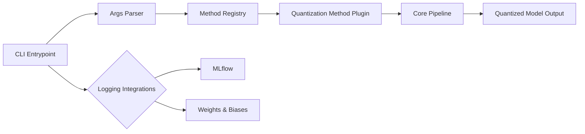
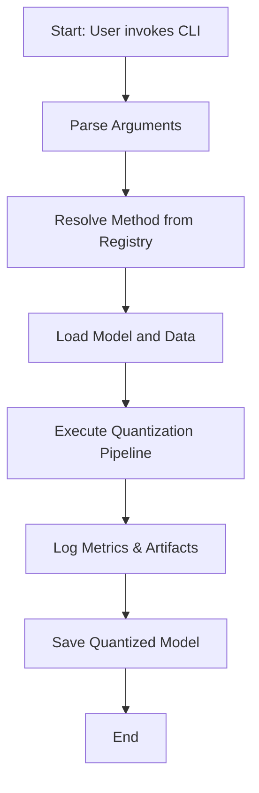

# quantool

Quantization pipelines under one library.

> **Under development**

## Table of Contents

- [Overview](#overview)
- [Features](#features)
- [Installation](#installation)
- [Usage](#usage)
- [Project Structure](#project-structure)
- [System Architecture](#system-architecture)
- [Workflow Process](#workflow-process)
- [Contributing](#contributing)
- [License](#license)

## Overview

`quantool` provides a unified interface for various model quantization methods, allowing users to compress and accelerate machine learning models with ease.

## Features

- Unified CLI for multiple quantization algorithms
- Plugin-based architecture for extendability
- Built-in support for logging experiments with MLflow and Weights & Biases
- Modular core pipeline for preprocessing, calibration, and quantization

## Installation

```bash
git clone https://github.com/langtech-bsc/quantool.git
cd quantool
pip install -e .
```

## Usage

Basic CLI example:
```bash
quantool TODO
```

Run `quantool --help` for a full list of options.

## Project Structure

```
quantool/
├── args/             # Command-line argument definitions
│   ├── common_args.py
│   └── quantization_args.py
├── core/             # Core pipeline components (preprocess, calibrate, quantize)
│   ├── base.py
│   ├── helpers.py
│   └── registry.py
├── entrypoints/      # CLI and other entrypoints
│   └── cli.py
├── loggers/          # Experiment logging integrations
│   ├── mlflow.py
│   └── wandb.py
├── methods/          # Quantization method implementations
│   ├── aqml.py
│   ├── awq.py
│   ├── gguf.py
│   ├── gptq.py
│   └── higgs.py
└── tests/            # Unit and integration tests
```

## System Architecture



## Workflow Process



## Contributing

Contributions are welcome! Please read [CONTRIBUTING.md](CONTRIBUTING.md) for guidelines.

## License

Distributed under the TODO License. See [LICENSE](LICENSE) for more information.
