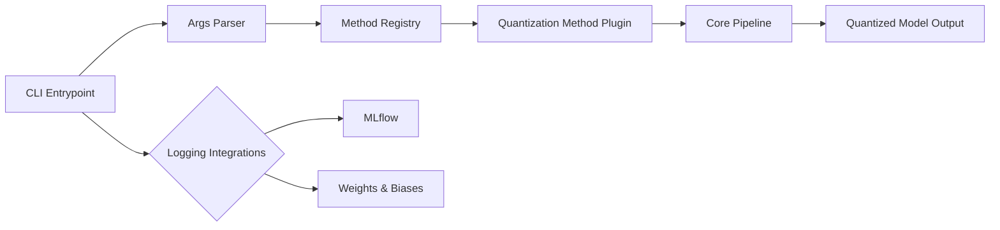
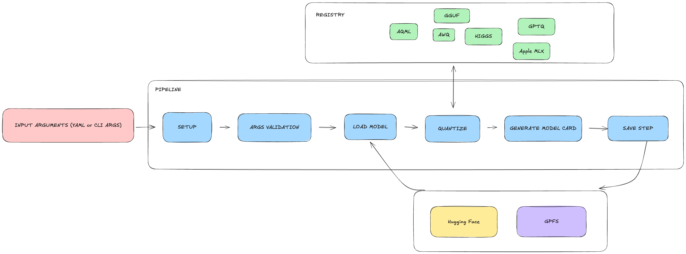
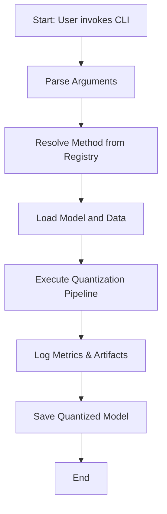

# quantool

Quantization pipelines under one library.

> **Under development**

## Table of Contents

- [Overview](#overview)
- [Features](#features)
- [Supported Methods](#supported-Methods)
- [Installation](#installation)
- [Usage](#usage)
- [Project Structure](#project-structure)
- [System Architecture](#system-architecture)
- [Workflow Process](#workflow-process)
- [Contributing](#contributing)
- [License](#license)

## Overview

`quantool` provides a unified interface for various model quantization methods, allowing users to compress and accelerate machine learning models with ease.

## Features

- Unified CLI for multiple quantization algorithms
- Plugin-based architecture for extendability
- Built-in support for logging experiments with MLflow and Weights & Biases
- Modular core pipeline for preprocessing, quantization and evaluation

## Supported Methods
  - [x] GGUF
  - [ ] AWQ
  - [ ] GPTQ
  - [ ] GPTQv2
  - [ ] EXL2
  - [ ] AQLM
  - [ ] HIGGS
  - [ ] MLX

## Installation

```bash
git clone https://github.com/langtech-bsc/quantool.git
cd quantool
pip install -e .
```

To install llama.cpp only:
```bash
git clone  https://github.com/langtech-bsc/quantool.git
cd quantool
pip install -e '.[llama-cpp]'
``` 

## Usage

Basic CLI example:
```bash
quantool config.yaml
```

Run `quantool --help` for a full list of options.

## Example Configuration for llama_cpp

Use a YAML config file to run quantization with llama_cpp to do gguf quantization:
```yaml
# config.yaml
model_id: "facebook/llama-7b"
method: "gguf"
quantization_config:
  llama_cpp_path: "/path/to/llama.cpp/executable"
```

## Project Structure

```
.
├── assets/                 # Diagrams and images
├── src/
│   └── quantool/           # Library source
│       ├── args/
│       ├── core/
│       ├── entrypoints/
│       ├── loggers/
│       ├── methods/
│       └── utils/
├── tests/                  # Unit and integration tests
│   ├── entrypoints/
│   ├── methods/
│   └── utils/
├── pyproject.toml
└── test_gguf_config.yaml   # Example configuration
```

## System Architecture





## Workflow Process



## Contributing

Contributions are welcome! Please read [CONTRIBUTING.md](CONTRIBUTING.md) for guidelines.

## License

Distributed under the TODO License. See [LICENSE](LICENSE) for more information.
