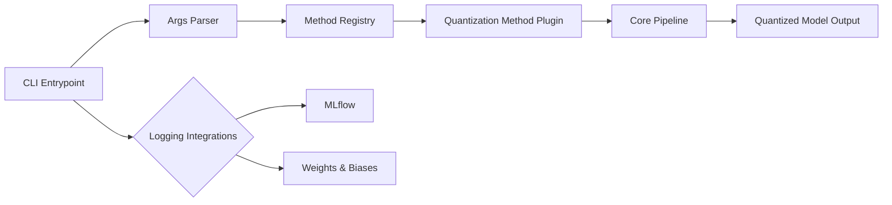
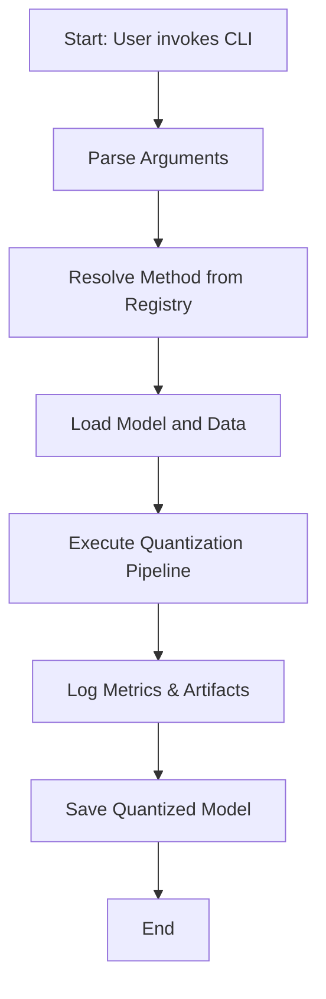

# quantool

Quantization pipelines under one library.

> **Under development**

## Table of Contents

- [Overview](#overview)
- [Features](#features)
- [Supported Methods](#supported-Methods)
- [Installation](#installation)
- [Usage](#usage)
- [Project Structure](#project-structure)
- [System Architecture](#system-architecture)
- [Workflow Process](#workflow-process)
- [Contributing](#contributing)
- [License](#license)

## Overview

`quantool` provides a unified interface for various model quantization methods, allowing users to compress and accelerate machine learning models with ease.

## Features

- Unified CLI for multiple quantization algorithms
- Plugin-based architecture for extendability
- Built-in support for logging experiments with MLflow and Weights & Biases
- Modular core pipeline for preprocessing, quantization and evaluation

## Supported Methods
  - [x] GGUF
  - [x] AWQ
  - [x] GPTQ
  - [x] SmoothQuant
  - [ ] GPTQv2
  - [ ] EXL2
  - [ ] AQLM
  - [ ] HIGGS
  - [ ] MLX

## Installation

```bash
git clone https://github.com/langtech-bsc/quantool.git
cd quantool
pip install -e .
```

To install llama.cpp only:
```bash
git clone  https://github.com/langtech-bsc/quantool.git
cd quantool
pip install -e '.[llama-cpp]'
``` 

## Usage

Basic CLI example:
```bash
quantool config.yaml
```

Run `quantool --help` for a full list of options.

## Configurable arguments

quantool uses dataclass-based argument groups. You can pass a YAML config containing values for these groups or override individual fields on the CLI. The most common argument groups are:

- ModelArguments
  - `model_id` (str) — Path or HF repo ID of the pretrained model.
  - `tokenizer_name` (str, optional) — Tokenizer path/name if different from model.
  - `cache_dir` (str, optional) — Cache directory for model/tokenizer.

- QuantizationArguments
  - `method` (str) — Quantization method (e.g. `gptq`, `awq`, `gguf`).
  - `quant_level` (str, optional) — Specific quant set label.
  - `quantization_config` (dict) — Method-specific configuration (passed as a JSON string on the CLI).

- CalibrationArguments
  - `dataset_id` / `dataset_path` — HF dataset id or local dataset path used for calibration.
  - `dataset_config` (str) — Dataset config name for HF datasets.
  - `split` (str) — Split to use (e.g. `train`).
  - `dataset_cache_dir` (str, optional) — Cache dir for datasets.
  - `sample_size` (int or null) — Number of calibration examples (null = full split).
  - `load_in_pipeline` (bool) — If true, pipeline loads and preprocesses the dataset and passes it to the quantizer.
  - `preprocess_fn` (str, optional) — Optional preprocessing function (module.func) to run on examples before calibration.

- ExportArguments
  - `output_path` (str) — Where to save the exported quantized model.
  - `push_to_hub` (bool) — Whether to push the result to the HF Hub.

- EvaluationArguments
  - `enable_evaluation` (bool) — Run evaluation after quantization.
  - `eval_dataset` (str) — Dataset to use for evaluation.

This README lists the most used fields; consult the dataclass definitions in `src/quantool/args/quantization_args.py` for the full set.

## Examples

1) Run with a YAML configuration file (recommended for repeatability):

```bash
quantool test_gptq_config.yaml
# Or, when running via python module entrypoint:
python -m quantool.entrypoints.cli test_gptq_config.yaml
```

2) Run by passing individual CLI arguments (overrides YAML or can be used standalone).
   Notes:
   - Field names are taken from dataclass attribute names. For dictionary fields like `quantization_config`
     supply a JSON string on the CLI.
   - If multiple dataclasses expose the same field name a conflict may occur; prefer YAML in that case.

Example (override some options on the CLI):

```bash
quantool \
  --model_id facebook/llama-7b \
  --method gguf \
  --quantization_config '{"llama_cpp_path": "/path/to/llama.cpp"}' \
  --dataset_id wikitext \
  --sample_size 512
```

Or using the python -m entrypoint:

```bash
python -m quantool.entrypoints.cli \
  --model_id facebook/llama-7b \
  --method gguf \
  --quantization_config '{"llama_cpp_path": "/path/to/llama.cpp"}' \
  --dataset_id wikitext \
  --sample_size 512
```

If you need complex nested method configuration, prefer a YAML file and pass it as the single positional argument.

## Example Configuration for llama_cpp

Use a YAML config file to run quantization with llama_cpp to do gguf quantization:
```yaml
# config.yaml
model_id: "facebook/llama-7b"
method: "gguf"
quantization_config:
  llama_cpp_path: "/path/to/llama.cpp/executable"
```

## Project Structure

```
.
├── assets/                 # Diagrams and images
├── src/
│   └── quantool/           # Library source
│       ├── args/
│       ├── core/
│       ├── entrypoints/
│       ├── loggers/
│       ├── methods/
│       └── utils/
├── tests/                  # Unit and integration tests
│   ├── entrypoints/
│   ├── methods/
│   └── utils/
├── pyproject.toml
└── test_gguf_config.yaml   # Example configuration
```

## System Architecture




## Workflow Process



## Contributing

Contributions are welcome! Please read [CONTRIBUTING.md](CONTRIBUTING.md) for guidelines.

## License

Distributed under the Apache-2.0 License. See [LICENSE](LICENSE.md) for more information.
